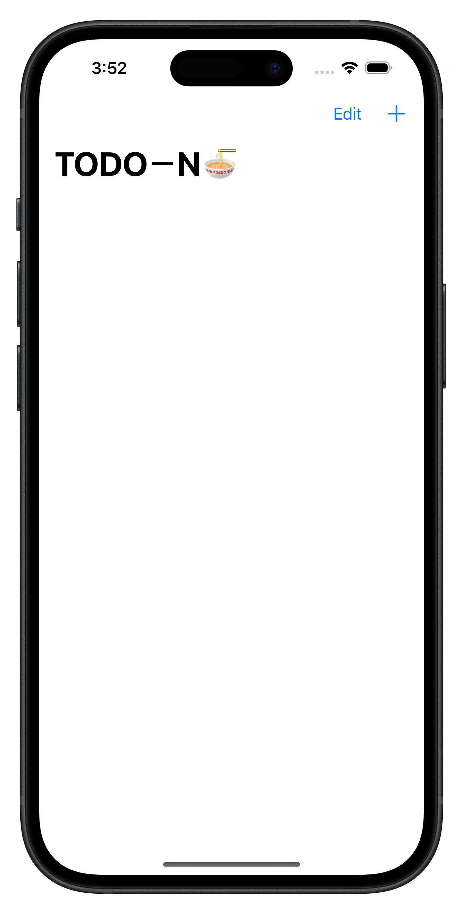
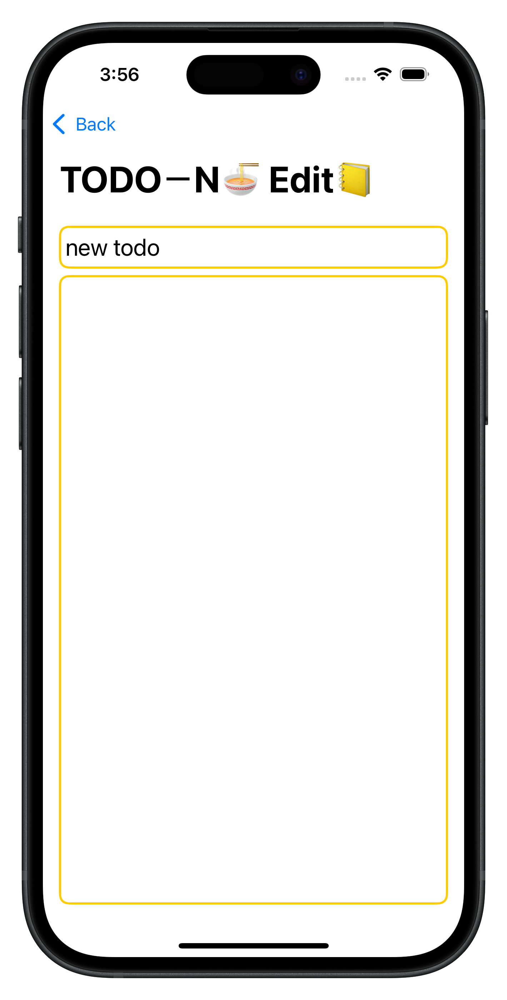
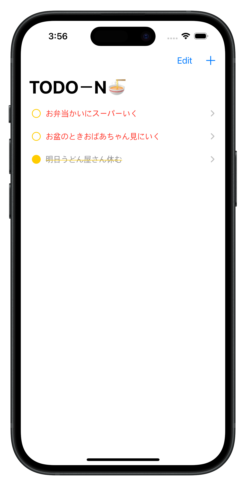
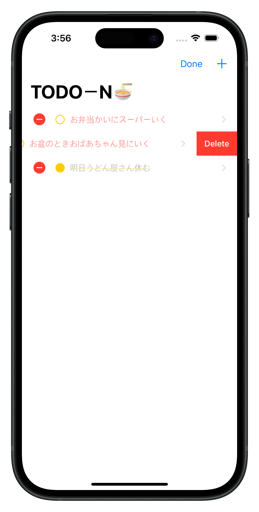

# iOS ToDo App🩵  

This is a basic iOS app created by following [https://www.inflearn.com/ja/course/진짜-왕초보-ios-swiftui].  

---

  
  
  
  

## 📗 What I Learned  
- Basic usage of **SwiftUI**  
- **NavigationStack / NavigationLink** for screen transitions  
- Using **toolbar** to add buttons  
- **Binding($)** and **Observable** for state management  
- Using **classes** and **functions** in Swift  
- Adding, deleting, and searching data  
- **SwiftData (WWDC 2023)** → ModelContainer, @Model, @Query  
- Keep data saved even after closing the app  

---

## ✨ Features  
- **Feature 1:** Add / delete / search ToDo items  
- **Feature 2:** Persistent data storage with SwiftData  

---

# iOS ToDoアプリ  

このアプリは [https://www.inflearn.com/ja/course/진짜-왕초보-ios-swiftui] を参考にして作成しました。  

---

## 📙 学んだこと  
- **SwiftUI** の基本的な使い方  
- **NavigationStack / NavigationLink** による画面遷移  
- **toolbar** を使ってボタンを追加  
- **Binding($)** と **Observable** を使った状態管理  
- **クラス** と **関数** の使い方  
- データの追加・削除・検索  
- **SwiftData (WWDC 2023)** → ModelContainer, @Model, @Query  
- アプリを終了してもデータを保存  

---

## ✨ 機能  
- **機能1:** ToDo の追加・削除・検索  
- **機能2:** SwiftData によるデータの永続保存

